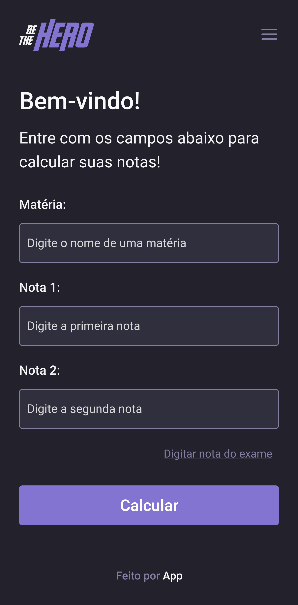

Dentro de um software, o "guia do usuário" refere-se a um recurso ou conjunto de informações que fornecem orientações, instruções e detalhes sobre como utilizar o software. É um elemento fundamental para auxiliar os usuários a compreenderem e utilizarem corretamente as funcionalidades do software.

O guia do usuário pode adotar diferentes formatos, como um manual do usuário em texto, um arquivo de ajuda integrado ao software, um tutorial em vídeo ou até mesmo uma documentação online. Seu objetivo principal é fornecer aos usuários informações claras e concisas sobre como realizar tarefas específicas no software, além de orientá-los sobre os recursos, configurações e opções disponíveis.

Normalmente, o guia do usuário contém descrições detalhadas das funcionalidades do software, instruções passo a passo sobre como executar determinadas tarefas, explicações sobre os elementos da interface do usuário, requisitos de sistema, solução de problemas comuns e outras informações relevantes para facilitar o uso eficiente do software.

A qualidade e a abrangência do guia do usuário desempenham um papel fundamental na experiência do usuário ao utilizar o software. Portanto, é importante que os desenvolvedores e os responsáveis pela criação do software dediquem tempo e esforço para elaborar um guia do usuário claro, completo e de fácil compreensão, garantindo assim uma experiência positiva para os usuários.

### Calculadora 
Na tela inicial do software, os usuários são recebidos por uma mensagem de "boas-vindas" e são apresentados aos campos de inserção de dados para o cálculo e cadastro de notas. Nessa tela, existem campos específicos designados para informar o nome da disciplina, as notas do 1º e 2º bimestres, além de um botão "Calcular" para enviar as informações. Adicionalmente, a tela oferece a opção de inserir a nota do exame, caso o aluno tenha realizado uma avaliação final e deseje calcular sua nota semestral final. Essas funcionalidades fornecem aos usuários uma maneira prática e eficiente de registrar suas notas.

  

### Feedback
Após submeter as notas da disciplina, o aplicativo exibirá uma tela detalhada com o cálculo realizado para obter a média semestral. Nessa tela, caso a média obtida seja maior que 70.00, o resultado será apresentado em cor verde, indicando que o aluno atingiu um desempenho satisfatório no semestre. Por outro lado, se a média semestral for menor que 70.00, a tela exibirá o resultado em cor vermelha, sinalizando a necessidade de uma avaliação final. Nesse caso, o aplicativo também mostrará a nota mínima necessária a ser obtida no exame para garantir uma média final que assegure a aprovação do aluno. Essa funcionalidade permite que os estudantes tenham clareza sobre o seu desempenho e possam se planejar para alcançar seus objetivos acadêmicos de forma eficiente.

  
 

 

### Home
A tela inicial, chamada "Home", apresenta uma lista de todas as matérias previamente cadastradas, juntamente com suas respectivas médias. Além disso, essa tela oferece a possibilidade de visualizar mais detalhes sobre os dados inseridos para cada disciplina. É possível obter informações como notas individuais, frequência ou outros dados relevantes para o acompanhamento acadêmico.

Adicionalmente, a tela disponibiliza funcionalidades para adicionar e/ou remover uma matéria, caso o usuário queira fazer ajustes em seu conjunto de disciplinas cadastradas. Com uma interface intuitiva, o aplicativo permite que os usuários gerenciem suas informações acadêmicas de forma prática e eficiente.

Essa abordagem facilita o acesso rápido aos dados relevantes, permitindo que os usuários tenham uma visão completa de seu desempenho e possam tomar decisões informadas sobre seus estudos. Com a praticidade oferecida pelo aplicativo, os usuários podem organizar e monitorar suas informações acadêmicas de maneira simples e conveniente.

  

### Menu
Em todas as telas do aplicativo, é possível encontrar um ícone localizado no canto superior direito, que serve como um menu de navegação. Esse ícone desempenha o papel de um ponto de acesso rápido para diferentes seções do aplicativo. Ao tocar nesse ícone, os usuários têm a opção de retornar à tela inicial, que é a tela de cálculo de notas, onde podem inserir os dados necessários para obter a média desejada.

Além disso, o menu também oferece acesso às matérias já cadastradas, permitindo que os usuários visualizem e gerenciem as disciplinas existentes de forma conveniente. Isso proporciona um controle completo sobre as informações acadêmicas registradas.

Por fim, o menu também fornece informações sobre o aplicativo, oferecendo detalhes adicionais sobre os membros do projeto e o objetivo por trás do desenvolvimento do aplicativo. Essa seção do menu proporciona aos usuários uma visão mais completa do contexto e das pessoas envolvidas no desenvolvimento do aplicativo, criando uma conexão mais próxima entre os usuários e a equipe responsável pela sua criação.

Essa abordagem de menu de navegação facilita a navegação entre as diferentes partes do aplicativo, tornando a experiência do usuário mais fluída e intuitiva.

  

### Sobre
Na tela "Sobre" do aplicativo, os usuários têm acesso ao objetivo que inspirou a construção do aplicativo. É revelado que o projeto foi inicialmente proposto em um semestre e passou por refinamentos ao longo de outro. Essa informação proporciona aos usuários uma compreensão do contexto e do processo de desenvolvimento do aplicativo.

Além disso, a tela "Sobre" apresenta os membros do projeto de forma transparente. Cada membro é mencionado, e o aplicativo disponibiliza links para o GitHub individual de cada um. Isso permite que os usuários explorem mais informações sobre os integrantes do projeto, como seus perfis, contribuições e outros projetos em que estiveram envolvidos. Essa abordagem promove transparência e possibilita aos usuários conhecerem melhor a equipe responsável pelo aplicativo.

Ao fornecer links para o GitHub dos membros do projeto, o aplicativo também incentiva a colaboração e a troca de conhecimento com a comunidade de desenvolvedores. Os usuários interessados podem explorar o trabalho e o código-fonte de cada membro, assim como contribuir com sugestões, reportar problemas ou até mesmo colaborar em futuras versões do aplicativo.

Essa inclusão de informações sobre o objetivo do aplicativo e dos membros do projeto na tela "Sobre" oferece aos usuários uma perspectiva mais completa sobre a motivação por trás do desenvolvimento do aplicativo e a equipe envolvida, criando uma experiência mais envolvente e transparente.

  
